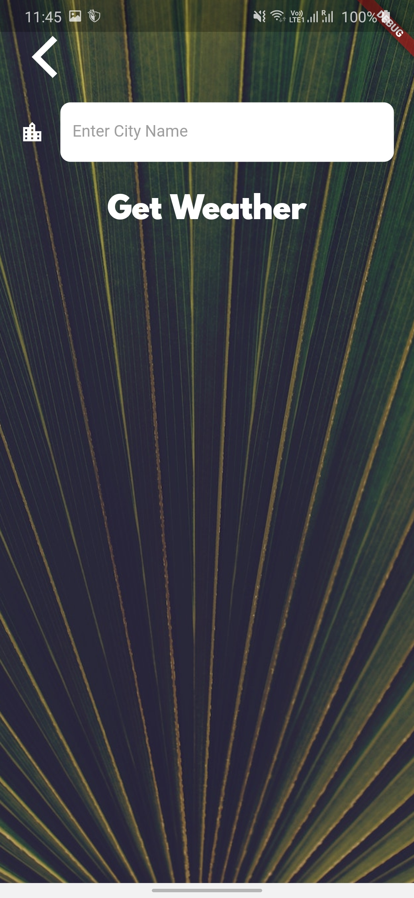

# Cli-Mate
A weather app inspired by the beautiful designs made by Olia Gozha. By the end of the module, we'll be able to find out the live weather data in the current location of the device as well as the weather for any city we can think of!

## Loading Screen

* Opening of page with loading indication using flutter_spinkit package
* Ask for user's permission for accessing location(one time)

## Home Screen

* Dynamic Home page indicating current temperature, city name, and condition
* Device location obtained by getting GPS location using geolocator package
* Data rendered from openweather.org API using http package
* JSON decoded with help of convert package

## Search Screen

* Option to get weather of desired city using search option
